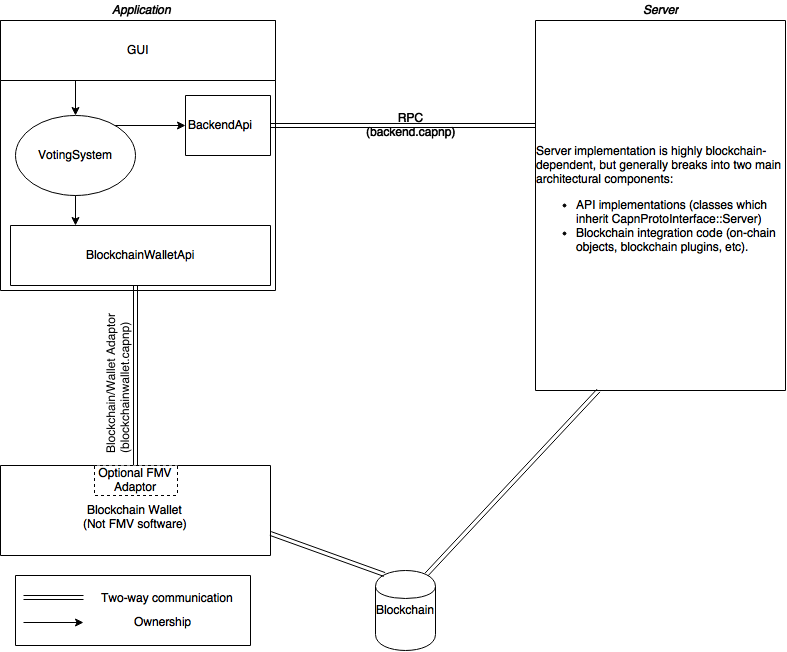

# Architecture of the Stake Weighted Voting Application

This document describes the software architecture used for the Stake-Weighed Voting application. Only the application
is documented here; external components such as the server and the blockchain/wallet adaptor are documented in their
respective repositories.

The interface to the server is defined [here](shared/capnp/backend.capnp) and the interface to the blockchain wallet is
defined [here](shared/capnp/blockchainwallet.capnp).

The GUI in the application is written in QML, and it is the logical entry point of the application. `main()`'s purpose
is to set up the QML environment, any global initializations, and launch the UI. It is probably not a good place to
start when trying to understand how the application functions.

All classes belonging solely to the voting application should be in the `swv` namespace.

The central controller for the application is `VotingSystem`, which is instantiated in from the GUI in
[main.qml](VotingApp/qml/main.qml). `VotingSystem` is a controller class and generally only one will exist per
application.

The `VotingSystem` creates and owns two main interfaces: `[BackendApi](VotingApp/Apis/BackendApi.hpp)`, which
communicates with the server; and `[BlockchainWalletApi](VotingApp/Apis/BlockchainWalletApi.hpp)`, which communicates
with the blockchain wallet. These classes are just wrappers around CapnProto RPC APIs, and generally exist for the
duration of the application's execution. Other API wrappers are defined [here](VotingApp/Apis/) and are created and
destroyed as necessary.

The `BackendApi` wraps a `Backend::Client` object, which is the Cap'n Proto generated client for the interface defined
in `[backend.capnp](shared/capnp/backend.capnp)`. This class has methods which expose Backend calls to QML using
QML-friendly types, and wrap the returned data or APIs in other wrappers. Data is wrapped in
[DataStructures](VotingApp/DataStructures/README.md) while APIs are wrapped in [Apis](VotingApp/Apis/README.md).

The `BlockchainWalletApi` wraps some implementor of `[BlockchainWallet](shared/capnp/blockchainwallet.capnp)` and
exposes blockchain functionality to callers, similarly to `BackendApi`.

Lifetime of these wrappers (Apis and DataStructures) must be handled carefully, as sometimes they are created in C++
but transferred to QML (and thus the QML runtime owns and must delete them), but in other cases, the C++ retains
ownership. Any time a raw pointer is returned, the function should be documented as to whether the returned object is
owned by the caller or callee. The [C++/QML Data Ownership
Documentation](http://doc.qt.io/qt-5/qtqml-cppintegration-data.html#data-ownership) explains the circumstances under
which ownership is transferred, and **must** be understood before working with any of the wrapper classes.

> ###### Implementation Note: When the C++ classes return a `Promise`, the C++ retains ownership of the promise until
> the promise resolves or breaks. At that point, Promise ownership transfers to QML. This is to avoid QML garbage
> collecting the promise before it resolves, since the C++ has no good way of knowing this happened and will attempt to
> use the deleted object.
